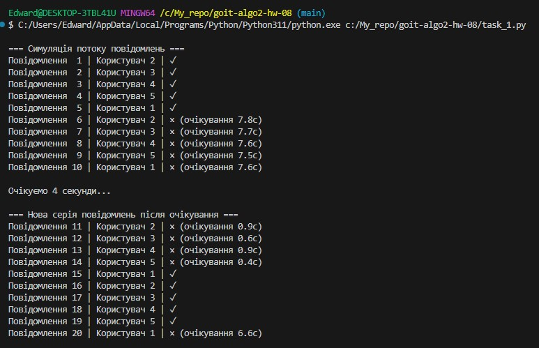
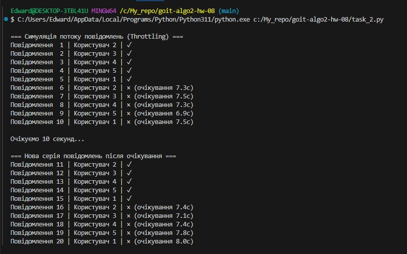

# Домашнє завдання до теми «Алгоритми контролю потоку та обмеження швидкості»

## ✅ Завдання 1. Реалізація Rate Limiter з використанням алгоритму Sliding Window для обмеження частоти повідомлень у чаті

## ✅ Завдання 2. Реалізація Rate Limiter з використанням алгоритму Throttling для обмеження частоти повідомлень у чаті

